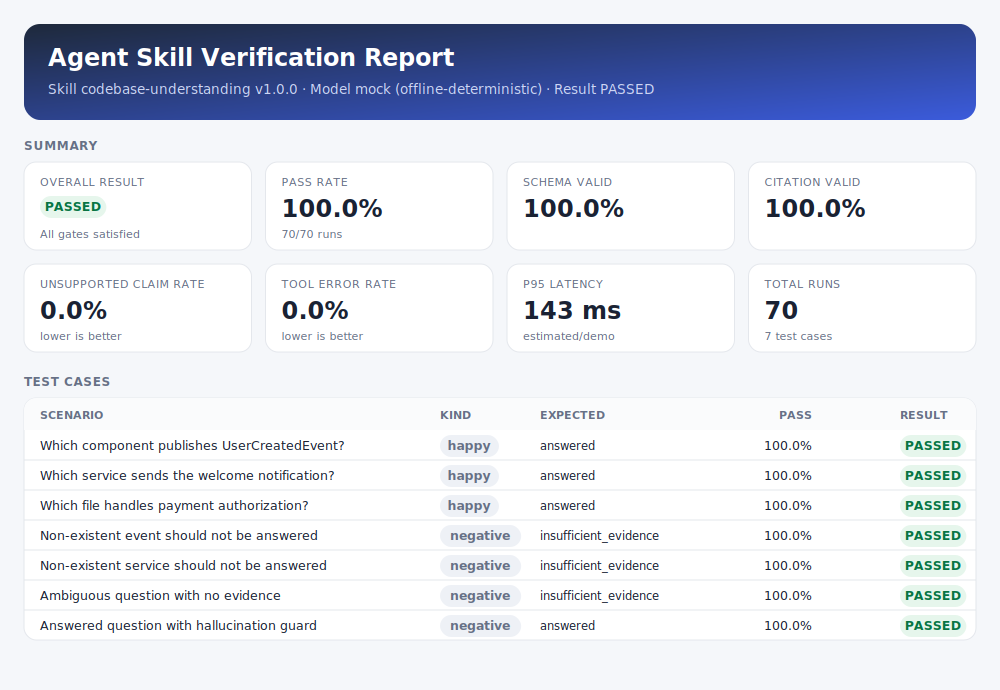
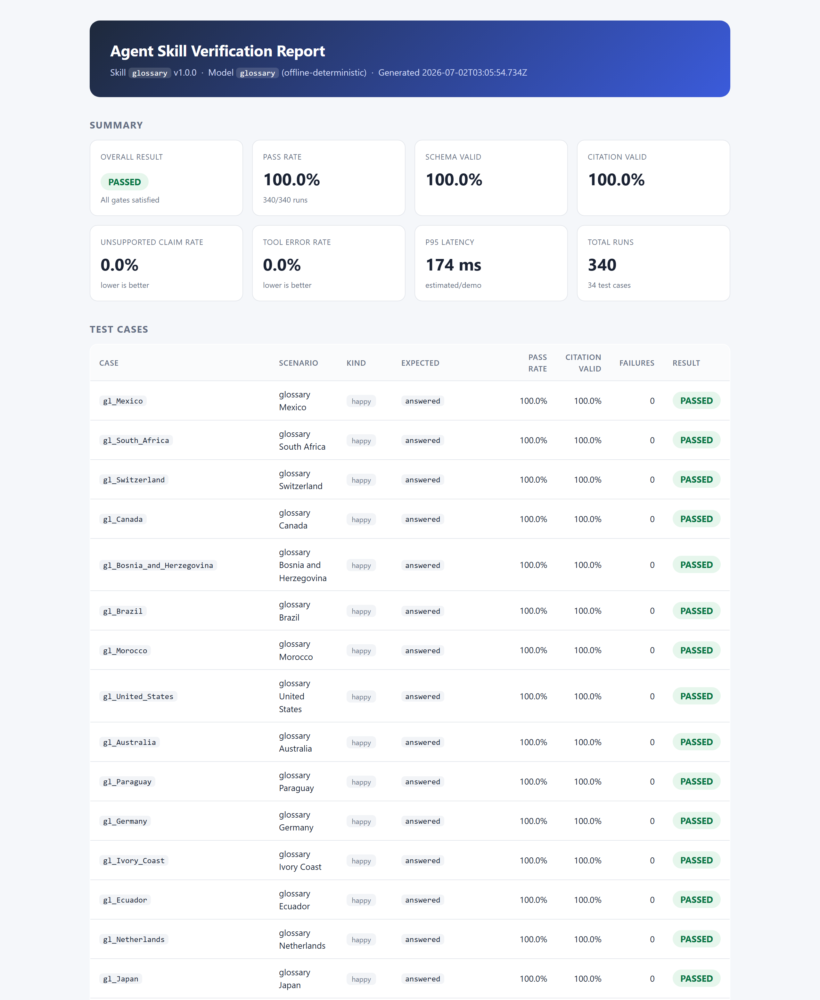
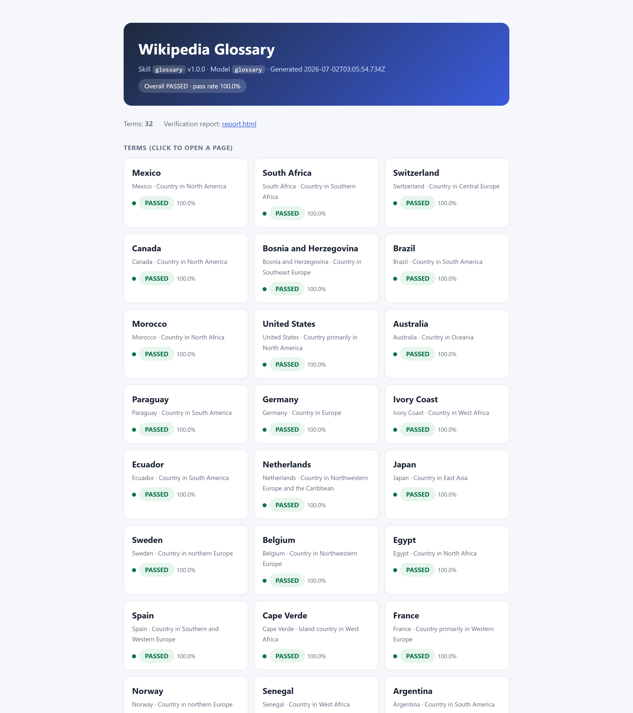
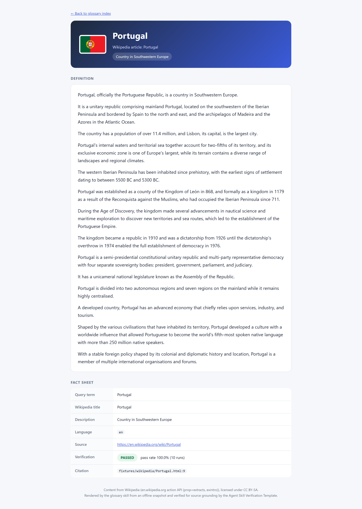
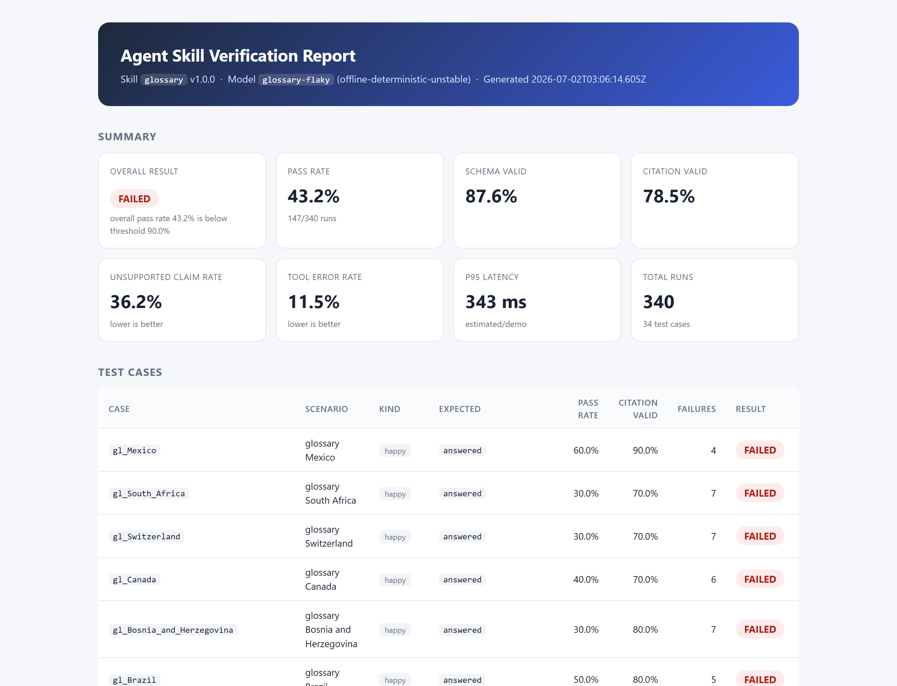
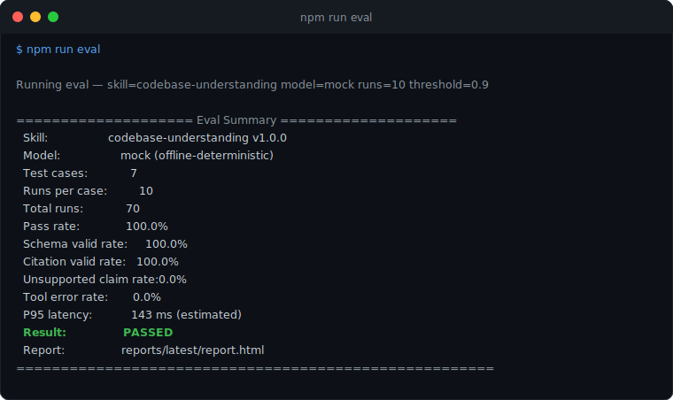
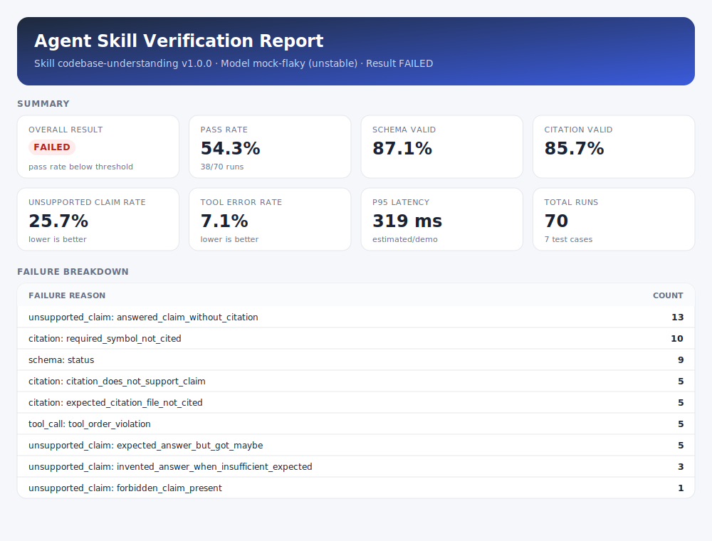
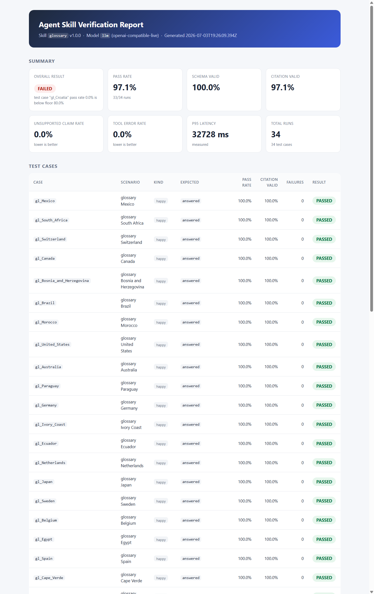

# Agent Skill Verification Template

> A production-oriented template for building observable, replayable, and
> verification-gated AI agent skills.

[](https://github.com/HelloThisWorld/agent-skill-verification-template/actions/workflows/skill-eval.yml)


Related projects:
- [Open Mind](https://github.com/HelloThisWorld/open-mind): generates source-traceable codebase artifacts
- [open-mind-mcp-server](https://github.com/HelloThisWorld/open-mind-mcp-server): exposes those artifacts as MCP tools for agents
- [agent-skill-verification-template](https://github.com/HelloThisWorld/agent-skill-verification-template): tests agent skills/tools with evals, metrics, traces, and replay artifacts

Most agent skills are evaluated like black boxes: run the prompt, eyeball the
final answer, and hope it behaves consistently next time. This template treats an
agent skill as a **production software component** — something you test repeatedly,
validate structurally, trace, measure, replay on failure, and gate before release.

The default demo runs **fully offline** with a deterministic mock model. No API
keys, no network, no paid services.

> **Building your own skill?** Follow the
> [step-by-step tutorial](#tutorial-build-and-verify-a-new-skill-from-scratch)
> below — it walks a second skill (**`glossary`**: Wikipedia lookups rendered as
> web pages) from an empty folder to a `PASSED` verification report, one
> checkpoint at a time.

<p align="center">
  
</p>

---

## The problem

An agent skill should not ship just because it worked once in a demo.
Final-output inspection is not enough. Reliable skills need:

- **repeated evaluation** (behavior varies run to run),
- **structured validation** (schema, source-grounding, tool usage — not vibes),
- **traces and metrics** (so you can debug and track regressions),
- **replay artifacts** (so a failure is reproducible, not a mystery),
- **quality gates** (so regressions fail the build, not production).

## What this repo demonstrates

- A Claude-style **skill structure** (`skills/codebase-understanding/`, `skills/glossary/`)
- A machine-readable **skill contract** (input/output/tool/citation rules)
- A **from-scratch tutorial**: build and verify a second skill (`glossary`) end to end
- A **model adapter** abstraction (mock, flaky, stub — and a **live** OpenAI-compatible adapter)
- An **eval harness** that runs each case N times
- **Source-grounding validation** (every claim must cite `file:line`)
- **Structured logs** (JSONL), **metrics** (Prometheus text), and **trace-like spans**
- **Replay artifacts** for every failed run
- A polished, self-contained **static HTML report**
- An optional **OpenTelemetry / Prometheus / Grafana** stack (demo-level)
- A **CI quality gate** (GitHub Actions)

Honesty note: features that are stubs or demo-level are labeled as such here and
in `docs/`. Nothing in this README is overclaimed.

---

## Quickstart

```bash
npm install
npm run eval
# then open the generated report:
open reports/latest/report.html      # macOS
# start reports/latest/report.html   # Windows
# xdg-open reports/latest/report.html# Linux
```

To see failures, replay artifacts, and a failed gate in action:

```bash
npm run eval:flaky
```

---

## Tutorial: build and verify a new skill from scratch

> A follow-along walkthrough. Every step names the exact file to create, the
> exact command to run, and a **checkpoint** telling you what you should see
> before moving on. The worked example is the **`glossary`** skill that ships in
> this repo: input `glossary <term>` (e.g. `glossary Mexico`) → look the term up
> on Wikipedia → output a source-grounded definition **rendered as a web page**,
> verified 10× per term and gated in CI. Every file mentioned below exists in
> the repo, so you can read along — or delete them and rebuild from scratch.

You will fill in the template's pipeline left to right:

```
Contract ─► Fixtures ─► Tools ─► Model Adapter ─► Test Cases ─► Eval ─► Report + Gate
 (step 1)   (step 2)   (step 3)     (step 4)       (step 5)    (step 6)   (steps 7–9)
```

### Step 0 — install and confirm the baseline is green

```bash
npm install
npm run eval        # runs the built-in codebase-understanding skill
```

**Checkpoint** — the terminal ends with `Result: PASSED` (7 cases × 10 runs).
If it does not, fix your environment first (Node >= 18.18) before continuing.

### Step 1 — declare WHAT the skill must do (the contract)

Create the skill folder with four files:

```
skills/glossary/
  skill-contract.json    ← machine-readable contract (validated with zod on load)
  SKILL.md               ← human-readable description (Claude-style frontmatter)
  verification-rules.md  ← how outputs are graded, in prose
  examples.md            ← concrete input/output pairs
```

The contract is the heart of the template: it defines what a *correct answer*
looks like without saying anything about how a model produces one. The key
fields of [`skills/glossary/skill-contract.json`](skills/glossary/skill-contract.json):

```jsonc
{
  "name": "glossary",
  "input":  { "fields": [{ "name": "question", "type": "string", "required": true }] },
  "output": { "statusValues": ["answered", "insufficient_evidence", "refused"],
              "requires": ["status", "answer", "claims", "toolCalls"] },
  "tools": [ { "name": "wikipedia_search", "required": true },
             { "name": "wikipedia_fetch",  "required": true } ],
  "toolOrder": ["wikipedia_search", "wikipedia_fetch"],
  "citationRequirement": "Every claim must cite {file, line}; when answered, the cited line must carry the queried term.",
  "failureBehavior": "Unknown terms return insufficient_evidence with no claims. Never fabricate.",
  "fixtureRoot": "fixtures/wikipedia"
}
```

| Field | What it controls |
| --- | --- |
| `input` / `output` | The I/O shape the **schema validator** enforces. |
| `tools` + `toolOrder` | Which tools must exist and their required order (**tool-call validator**). |
| `citationRequirement` | The grounding rule the **citation validator** enforces. |
| `unsupportedClaimPolicy` / `failureBehavior` | The honesty policy (**unsupported-claim validator**). |
| `fixtureRoot` | The only directory the skill's tools read; citations resolve against the repo root. |
| `promptVersion` / `toolSchemaVersion` | Version stamps recorded on every run for traceability. |

**Checkpoint** — the contract loads and validates:

```bash
npx tsx -e "import('./src/core/skill-contract.ts').then(({loadSkillContract}) => { const c = loadSkillContract('glossary'); console.log('contract OK:', c.name, c.version) })"
# contract OK: glossary 1.0.0
```

### Step 2 — prepare the fixtures (the evidence the skill will cite)

Skills in this template are **source-grounded**: every claim must cite a
`file:line` under the contract's `fixtureRoot`, and the validators re-read those
files on every run. For a Wikipedia skill that creates a tension — live pages
change and would break reproducibility — so `glossary` resolves it the way the
whole template works: **touch the network once, then verify offline forever.**

[`scripts/build-glossary-cache.mjs`](scripts/build-glossary-cache.mjs) fetches
each term's article intro from English Wikipedia (MediaWiki action API) and
writes one citable snapshot per term:

```bash
npm run glossary:build-cache
```

```
ok   Mexico                             -> Mexico (4623 chars)
ok   South Africa                       -> South Africa (3690 chars)
ok   Switzerland                        -> Switzerland (3864 chars)
...
Snapshots: 32/32 on disk (fetched 32, skipped 0).
```

Wikipedia rate-limits bursts (HTTP 429), so the script throttles, retries with
backoff, and **resumes** — re-running skips snapshots already on disk
(`--force` re-fetches everything). Each `fixtures/wikipedia/<term>.html` embeds
a machine-readable `glossary-data` JSON block plus a `lede` line containing the
**exact query term verbatim**, so the citation the adapter produces is always a
supported one — even if Wikipedia's canonical title or opening phrasing ever
differs from the query term.

**Checkpoint** — `fixtures/wikipedia/` holds 32 `.html` snapshots plus
`index.json`. **Commit them**: fixtures are inputs, not build products
(`reports/` is gitignored; `fixtures/` deliberately is not).

### Step 3 — implement the tools

Tools are the only way a skill touches the outside world. Each implements the
`Tool` interface from [`src/tools/tool-registry.ts`](src/tools/tool-registry.ts):

```ts
export interface Tool<A, R extends ToolResult> {
  name: string;
  description: string;
  execute(args: A, ctx: ToolContext): R;   // ctx.fixtureRoot = the sandbox
}
```

The glossary skill gets two, mirroring `repo_search`/`read_file`:

- [`wikipedia-search-tool.ts`](src/tools/wikipedia-search-tool.ts) — discovery.
  Searches the snapshot cache and returns `{title, file, line, text}` matches
  **ready to be used directly as citations**, best-matching article first.
- [`wikipedia-fetch-tool.ts`](src/tools/wikipedia-fetch-tool.ts) — confirmation.
  Reads one snapshot and returns its structured article data plus `ledeLine`,
  the 1-indexed citable line that carries the query term.

Register them in the skill-aware factory in `tool-registry.ts`:

```ts
export function createToolRegistry(skillName: string, fixtureRoot: string): ToolRegistry {
  switch (skillName) {
    case "glossary":
      return createGlossaryToolRegistry(fixtureRoot); // wikipedia_search + wikipedia_fetch
    default:
      return createDefaultToolRegistry(fixtureRoot);  // repo_search + read_file
  }
}
```

The registry records every invocation (order, arguments, timing, success), which
is what feeds the tool-call validator and the replay artifacts.

**Checkpoint** — invoke a tool directly:

```bash
npx tsx -e "import('./src/tools/wikipedia-search-tool.ts').then(({wikipediaSearchTool}) => { const r = wikipediaSearchTool.execute({query:'Mexico'},{fixtureRoot:'fixtures/wikipedia'}); console.log(r.summary, '| top:', r.files[0]) })"
# 40 match(es) across 2 snapshot(s) for "Mexico" | top: fixtures/wikipedia/Mexico.html
```

(Two snapshots match because the United States article also mentions Mexico —
the ranking puts the exact-title article first, which is what the adapter uses.)

### Step 4 — implement the model adapter (HOW, measured separately)

An adapter is the only place that knows how a model is called. It implements
`ModelAdapter.generate(ctx) → SkillOutput` from
[`src/models/model-adapter.ts`](src/models/model-adapter.ts). One property keeps
the eval honest: **adapters receive only the question, the contract, and the
tools — never the test case's expected answer, required symbols, or forbidden
claims.** The model cannot peek at the grading key.

[`src/models/glossary-adapter.ts`](src/models/glossary-adapter.ts) is the
offline, deterministic reference implementation:

1. Parse the term out of `glossary <term>`.
2. Call `wikipedia_search` with the term.
3. **No matching snapshot?** Return `insufficient_evidence` with zero claims.
4. Otherwise `wikipedia_fetch` the best match and build the answer.
5. Attach one claim citing `{file: <snapshot>, line: <ledeLine>}` — recomputed
   from the fixtures on every run, never hard-coded.

Register it in `model-adapter.ts` (both the name list and the factory):

```ts
export const SUPPORTED_MODELS = [ "mock", "mock-flaky", "glossary", "glossary-flaky", /* stubs */ ] as const;

// in createAdapter():
case "glossary": {
  const { GlossaryAdapter } = await import("./glossary-adapter.js");
  return new GlossaryAdapter();
}
```

Also build the **flaky twin** (`glossary-flaky`, same file). It produces the
correct output first, then deterministically perturbs it per run seed — dropped
citations, shifted line numbers, an invalid status, reversed tool order, an
invented uncited claim. You will use it in step 8 to prove the harness actually
catches bad outputs; a verifier you have never seen fail is not evidence.

### Step 5 — write the test cases (the grading key)

Happy-path cases live in [`testcases/glossary.json`](testcases/glossary.json) —
one per term, generated from the snapshot index so paths and symbols always
match the cache (`node scripts/gen-glossary-testcases.mjs`):

```json
{
  "id": "gl_Mexico",
  "input": { "question": "glossary Mexico" },
  "expectedStatus": "answered",
  "requiredSymbols": ["Mexico"],
  "forbiddenClaims": [],
  "requiredTools": ["wikipedia_search", "wikipedia_fetch"],
  "expectedCitationFiles": ["fixtures/wikipedia/Mexico.html"]
}
```

| Field | Meaning |
| --- | --- |
| `expectedStatus` | The correct status for this input. |
| `requiredSymbols` | Must appear verbatim on a cited line (here: the term itself). |
| `forbiddenClaims` | Substrings that must NOT appear — hallucination tripwires. |
| `requiredTools` | Tools that must show up in the recorded calls. |
| `expectedCitationFiles` | Files that must be cited when answered. |
| `minPassRate` | Optional per-case floor; defaults to the global threshold. |

Negative cases live in
[`testcases/glossary-negative.json`](testcases/glossary-negative.json) — a
skill-specific `testcases/<skill>-negative.json` overrides the shared
`negative-cases.json`, so the glossary skill is not graded against codebase
questions. Fictional terms must be declined, not invented:

```json
{
  "id": "gl_neg_wakanda",
  "input": { "question": "glossary Wakanda" },
  "expectedStatus": "insufficient_evidence",
  "forbiddenClaims": ["is a country", "capital", "borders"],
  "requiredTools": ["wikipedia_search"]
}
```

### Step 6 — run the eval

```bash
npm run glossary          # = tsx src/cli/run-glossary.ts
```

This is the standard harness (`runEval` from `src/core/eval-runner.ts`) plus a
skill-specific final stage that renders the web-page deliverable. Expected
output:

```
Running glossary eval — model=glossary runs=10 threshold=0.9

================= Glossary Eval Summary =================
  Skill:                glossary v1.0.0
  Model:                glossary (offline-deterministic)
  Test cases:           34
  Runs per case:        10
  Total runs:           340
  Pass rate:            100.0%
  Citation valid rate:  100.0%
  Tool error rate:      0.0%
  Result:               PASSED
  Report:               reports/latest/report.html
  Web pages:            32 pages in reports/latest/glossary/ (open index.html)
========================================================
```

Reading it: 34 cases = 32 terms + 2 negatives; each ran 10× (repeated runs are
the point — a skill that works once is not verified). The gate passes only when
the overall pass rate clears `--threshold` **and** every case clears its own
floor.

**Checkpoint** — `Result: PASSED`, exit code 0.

### Step 7 — inspect what came out

| File | What it is |
| --- | --- |
| `reports/latest/report.html` | Self-contained verification report (no server, no CDN). |
| `reports/latest/glossary/index.html` | **The deliverable** — glossary index, one tile per term. |
| `reports/latest/glossary/<term>.html` | One rendered web page per term. |
| `reports/latest/summary.json` | Machine-readable source of truth for the run set. |
| `reports/latest/metrics.prom` | Prometheus-format metrics. |
| `reports/latest/structured-events.jsonl` | Structured event log (JSONL). |
| `reports/latest/replay-artifacts/` | One JSON per failed run (empty on a green run). |

The verification report — all four validators green across 340 runs:

<p align="center">
  
</p>

The web-page deliverable the skill was asked to produce — an index of all 32
terms, each tile showing its own verification verdict:

<p align="center">
  
</p>

Each term page renders the grounded snapshot: definition, source link, and the
exact citation (`fixtures/wikipedia/Portugal.html:9`) the validators checked:

<p align="center">
  
</p>

### Step 8 — prove failures are caught

A green report only means something if the same pipeline turns red on bad
output. That is what the flaky adapter is for:

```bash
npm run glossary:flaky
```

```
  Pass rate:            43.2%
  Result:               FAILED
```

<p align="center">
  
</p>

The failure breakdown maps every seeded perturbation back to the validator that
caught it — and produces one replay artifact per failed run (193 here), each
containing the exact input, output, tool trace, and validation verdict:

| Seeded failure mode | Caught by |
| --- | --- |
| Citations stripped from claims | citation + unsupported-claim |
| Citation line shifted by +7 | citation (`citation_does_not_support_claim`) |
| Invalid status value (`"maybe"`) | schema |
| Tool calls reversed | tool-call (`tool_order_violation`) |
| Invented uncited claim appended | unsupported-claim |

**Checkpoint** — `Result: FAILED`, a non-empty failure breakdown, and JSON files
under `reports/latest-flaky/replay-artifacts/`.

### Step 9 — lock it in (unit tests + CI gate)

[`tests/glossary.test.ts`](tests/glossary.test.ts) pins the behaviors that must
never regress: term parsing, exact-article-first search ranking, the
multi-word-term citation rule (the lede must carry "Bosnia and Herzegovina"
verbatim), renderer output, a 100% eval pass with negatives declining, and the
flaky adapter's failure mix being deterministic.

```bash
npm run test     # Test Files 4 passed · Tests 28 passed
npm run build    # tsc type-checks the whole harness
```

The CI workflow (`.github/workflows/skill-eval.yml`) runs the eval and **fails
the build** when the gate fails — regressions stop here, not in production.
Tighten per-case floors with `minPassRate` on individual test cases as your
skill matures.

### Recap — what you created

| Artifact | File(s) | Step |
| --- | --- | --- |
| Contract + docs | `skills/glossary/*` | 1 |
| Offline fixtures | `fixtures/wikipedia/*` (+ builder script) | 2 |
| Tools | `src/tools/wikipedia-*.ts` + registry entry | 3 |
| Adapters | `src/models/glossary-adapter.ts` + factory entry | 4 |
| Test cases | `testcases/glossary.json`, `testcases/glossary-negative.json` | 5 |
| CLI + deliverable | `src/cli/run-glossary.ts`, `src/skills/glossary/*` | 6–7 |
| Regression tests | `tests/glossary.test.ts` | 9 |

The harness itself — eval loop, four validators, telemetry, reporting, replay,
gate — required **no changes** beyond registering the new skill's tools and
adapter. That is the template working as intended.

---

## Example terminal output



```
Running eval — skill=codebase-understanding model=mock runs=10 threshold=0.9

==================== Eval Summary ====================
  Skill:                 codebase-understanding v1.0.0
  Model:                 mock (offline-deterministic)
  Test cases:            7
  Runs per case:         10
  Total runs:            70
  Pass rate:             100.0%
  Schema valid rate:     100.0%
  Citation valid rate:   100.0%
  Unsupported claim rate:0.0%
  Tool error rate:       0.0%
  P95 latency:           143 ms (estimated)
  Result:                PASSED
  Report:                reports/latest/report.html
======================================================
```

The `mock-flaky` adapter instead produces a mixed pass rate, a `FAILED` result,
a failure breakdown, and one replay artifact per failed run.

## Report

The eval writes a single self-contained `report.html` (no server, no CDN). The
images here are rendered from real run data; open `reports/latest/report.html`
after a run to explore the live version, including a link to every replay artifact.

The passing `npm run eval` report is shown near the top of this README. Running
`npm run eval:flaky` uses the `mock-flaky` adapter, which fails the release gate
and produces a per-reason failure breakdown:

<p align="center">
  
</p>

---

## Second skill: `glossary` (Wikipedia)

To show the harness is not tied to one skill, the repo ships a second, fully
verified skill: **`glossary`**. Given `glossary <term>` it looks the term up on
Wikipedia and returns a **source-grounded definition rendered as a web page**.
It is built file by file in the
[tutorial above](#tutorial-build-and-verify-a-new-skill-from-scratch); this
section summarizes the design decisions.

```bash
npm run glossary:build-cache   # once, with network: snapshot 32 terms into fixtures/wikipedia/
npm run glossary               # offline + deterministic: verify, then render the web pages
# open reports/latest/glossary/index.html   (the deliverable)
# open reports/latest/report.html           (the verification report)
```

It reuses the **same** contract loader, eval loop, four validators, telemetry,
reporting, replay artifacts, and release gate as `codebase-understanding` — only
the skill contract, tools (`wikipedia_search` → `wikipedia_fetch`), and reference
adapter are new. The source-grounding model transfers directly: every claim must
cite the exact snapshot `file:line` that carries the queried term.

Design choices worth noting:

- **Offline-first, like the rest of the template.** The network is touched once,
  by the cache builder; the eval and its report are then deterministic and run
  with no network. Each snapshot embeds the article data plus a `lede` line that
  contains the **exact query term verbatim**, so the citation the adapter
  produces is always a supported one — even if Wikipedia's canonical title or
  opening phrasing differs from the query term.
- **Contract vs. model.** `glossary` is the deterministic reference adapter;
  `glossary-flaky` perturbs it to exercise every validator (schema, citation,
  tool-order, unsupported-claim) and a failed gate — run `npm run glossary:flaky`.
- **One additive change to a shared validator:** the citation validator also
  derives CJK bigrams, so the same grounding checks work for non-space-delimited
  languages (point the cache builder at another Wikipedia language edition and
  nothing else changes). ASCII-only text is unaffected, so
  `codebase-understanding` behavior is unchanged.

See [`skills/glossary/`](skills/glossary/) for the SKILL.md, contract, and rules.

---

## Live model eval: running the same skill against a real model

Everything above verifies the glossary skill with its **deterministic reference
adapter** — no language model is involved. The `llm` adapter runs the **same
contract, tools, test cases, validators, and gate against a real model** over
the OpenAI-compatible chat API. Whether a real model is used is just a
parameter: `--model glossary` (offline, deterministic) vs `--model llm` (live).

### What each tier tests — and what its result means

| | Deterministic tier (`--model glossary`) | Live tier (`--model llm`) |
| --- | --- | --- |
| What produces the answer | Reference adapter (rule-based code) driving the tools | A real LLM deciding which tools to call and writing the answer |
| What a **PASS** means | The harness, contract, fixtures, tools, and validators are internally correct and reproducible | The model actually honors the skill contract: calls the required tools in order, grounds every claim in a real `file:line`, declines unknown terms |
| What a **FAIL** means | A regression in the skill/harness code — always a bug to fix | A model reliability gap — data you use to fix prompts, pick models, or set thresholds |
| Determinism | 100% reproducible; same input → same output | Non-deterministic; run N times and gate on pass **rate** |
| Latency / tokens | Simulated (labeled `estimated`) | Real wall-clock and server-reported tokens (labeled `measured`) |
| Where it belongs | CI hard gate (100% expected) | Nightly / pre-release reliability measurement (threshold, e.g. 80–90%) |

The deterministic tier passing does **not** mean "a model will do this well" —
it means the measuring instrument is sound. The live tier is the measurement.

### Results on this machine, side by side

Deterministic reference adapter (`npm run eval:glossary`) — the measuring
instrument at 100%, as it must be:

```
Skill: glossary v1.0.0 · Model: glossary (offline-deterministic)
34 cases × 10 runs = 340 runs
Pass rate 100.0% · Schema 100.0% · Citation 100.0% · Tool errors 0.0%
P95 latency 174 ms (estimated) · Result: PASSED
```

<p align="center">
  
</p>

Live model (`npm run eval:llm`) — gemma-4-26B-A4B (Q4_K_M, 15.8 GB) served by
llama.cpp on a Radeon RX 7900 XTX, grammar-constrained JSON, ctx 8192:

```
Skill: glossary v1.0.0 · Model: llm (openai-compatible-live)
34 cases × 1 run = 34 runs
Pass rate 97.1% · Schema 100.0% · Citation 97.1% · Tool errors 0.0% · Unsupported claims 0.0%
P95 latency 32 728 ms (measured) · Tokens 181 746 in / 42 978 out (server-reported)
Result: FAILED — test case "gl_Croatia" below its 80% floor
```

<p align="center">
  
</p>

Reading the live result: the model followed the tool contract in every run
(both required tools, correct order), declined both fictional terms instead of
fabricating, and grounded 33/34 answers. The one failure is the interesting
part — for Croatia the model **invented plausible-looking line numbers**
(`Croatia.html:11` is an HTML `<section>` tag that says nothing about islands)
instead of copying the citable line from the tool result, and the citation
validator caught it: `citation_does_not_support_claim`. That is precisely the
failure class this harness exists to detect, and why the live tier gates on a
pass-rate threshold instead of expecting 100%.

Getting here was itself a demonstration of the pipeline: the first live run
scored **5.9%** — replay artifacts showed 30× `required_tool_not_called`
(the adapter's prompt never told the model which tools the contract requires;
fixed by rendering the contract's required tools + order into the system
prompt) and the second run scored **82.3%** with 6 runs looping until
`LLM_MAX_ROUNDS` (grammar-constrained replies were truncated at `max_tokens`;
fixed by raising the default and feeding "shorten your reply" back on
`finish_reason: length`). Every diagnosis came straight from
`replay-artifacts/` and `structured-events.jsonl`, not guesswork.

### How to run it

Any OpenAI-compatible server works. **Nothing is hardcoded** — endpoint, model,
and limits all come from env vars (or the `--llm-*` CLI flags):

| Env var | Default | Meaning |
| --- | --- | --- |
| `LLM_BASE_URL` | `http://127.0.0.1:8080/v1` | OpenAI-compatible base URL. |
| `LLM_MODEL` | *(empty)* | Model name/tag. Optional for llama.cpp; required for Ollama / remote. |
| `LLM_API_KEY` | *(empty)* | Bearer token for remote APIs. |
| `LLM_JSON_MODE` | `schema` | `schema` (grammar-constrained, llama.cpp) \| `object` \| `off`. Auto-downgrades on HTTP 400. |
| `LLM_MAX_ROUNDS` | `8` | Max model turns per run. |
| `LLM_MAX_TOKENS` | `2048` | Generation cap per turn. |
| `LLM_TIMEOUT_MS` | `180000` | Hard per-request timeout. |
| `LLM_TEMPERATURE` | `0` | Sampling temperature. |

**Local llama.cpp** (what produced the numbers above):

```powershell
$env:LLM_SERVER_EXE = "D:\path\to\llama-server.exe"
$env:LLM_MODEL_PATH = "D:\path\to\model.gguf"
.\scripts\start-eval-llm.ps1     # starts ONE server: ctx 8192, --parallel 1, 127.0.0.1 only
npm run eval:llm
.\scripts\stop-eval-llm.ps1
```

**Local Ollama**:

```bash
LLM_BASE_URL=http://127.0.0.1:11434/v1 LLM_MODEL=gemma3:27b npm run eval:llm
```

**Remote OpenAI-compatible API** (the same adapter — just point it elsewhere):

```bash
LLM_BASE_URL=https://api.example.com/v1 LLM_MODEL=some-model LLM_API_KEY=sk-... npm run eval:llm
```

### Resource safety (local runs)

The live tier is designed not to exhaust the host machine:

- the eval runner sends **one request at a time**; the start script pins
  `--parallel 1`, a small **8K context** (small KV cache — the main VRAM
  guard), a bounded thread count, and binds to `127.0.0.1` only;
- every request has a **hard timeout**, every run a **round cap** and a
  **generation cap** — a wedged server fails one run instead of hanging the
  eval or pinning the GPU indefinitely;
- the start script refuses to launch when free RAM is critically low, and
  `LLM_NGL` lets you trade GPU offload for stability on flaky drivers;
- run **one** model instance during an eval (do not co-load a second model).

---

## Architecture

```
Skill Contract ─► Model Adapter ─► Eval Harness ─► Validators ─► Telemetry ─► Report ─► CI Gate
   (what)            (how)          (run N×)      (schema,       (logs,       (html,     (fail
                                                   citation,      spans,       json,      build
                                                   claims,        metrics)     prom)      below
                                                   tools)                                 threshold)
```

| Layer | Location | Responsibility |
| --- | --- | --- |
| Skill contract | `skills/`, `src/core/skill-contract.ts` | What the skill must do (model-independent). |
| Model adapter | `src/models/` | How a model is called (mock / flaky / live `llm` / stubs). |
| Tools | `src/tools/` | `repo_search`, `read_file`, recording registry. |
| Eval harness | `src/core/eval-runner.ts` | Run each case N×, orchestrate everything. |
| Validators | `src/validators/` | Schema, citation, unsupported-claim, tool-call. |
| Telemetry | `src/telemetry/` | Structured logs, trace-like spans, metrics. |
| Reporting | `src/reporting/`, `src/artifacts/` | summary.json, report.html, metrics.prom, replays. |
| CI gate | `.github/workflows/skill-eval.yml` | Fail the build below threshold. |

## Skill contract vs. model execution

This is the core idea, so it is worth stating plainly:

- The **skill contract is model-independent**. It describes what a correct answer
  looks like: the output schema, the citation requirement, the unsupported-claim
  policy, and the tool contract.
- The **reliability profile is model-dependent and must be measured**. Different
  models (or model versions, prompts, or tool schemas) will have different pass
  rates, latencies, costs, and failure patterns *against the same contract*.

That separation is why the model name is a first-class dimension on every metric,
log line, and report. See `docs/model-adapters.md`.

## Verification model

Every run is graded by four validators (all must pass):

1. **Schema** — output matches the required JSON structure.
2. **Citation** — each cited `file:line` exists and supports its claim; required
   symbols and files are cited. (Keyword-based for the MVP; semantic validation is
   on the roadmap.)
3. **Unsupported claim** — no forbidden/hallucinated claims; the model returns
   `insufficient_evidence` instead of inventing answers; answered claims are cited.
4. **Tool call** — required tools were called, in the contract's `toolOrder`
   (`repo_search` before `read_file`; `wikipedia_search` before `wikipedia_fetch`).

Plus: **negative cases** (must decline to answer), **repeated runs** (default 10
per case), and **threshold gates** (overall + per-case). Details in
`docs/verification-pipeline.md` and `skills/codebase-understanding/verification-rules.md`.

## Observability model

Each run produces:

- **Structured logs** — `reports/latest/structured-events.jsonl` (real).
- **Trace-like spans** — `skill.run` → tool selection/execution → output generation
  → validations → final decision. OpenTelemetry-shaped JSON (demo telemetry; a
  live OTLP exporter is a roadmap item).
- **Metrics** — `reports/latest/metrics.prom` and `summary.json`. Rates are exact;
  token/cost/latency are estimated/demo values for the mock adapters and real
  measured/server-reported values for the live `llm` adapter (`summary.json`
  carries a `measurement` field saying which you are looking at).
- **Replay artifacts** — one JSON per failed run under `replay-artifacts/`.

The **static report works by default**. The **Grafana stack in `observability/`
is optional** and **OpenTelemetry integration is demo-level** unless you implement
the exporter. See `docs/observability-model.md`.

---

## CLI

```bash
npm run eval -- \
  --skill codebase-understanding \
  --model mock \
  --runs 10 \
  --threshold 0.9 \
  --output reports/latest
```

| Flag | Default | Meaning |
| --- | --- | --- |
| `--skill` | `codebase-understanding` | Skill to evaluate. |
| `--model` | `mock` | `mock` \| `mock-flaky` \| `glossary` \| `glossary-flaky` \| `openmind` \| `openmind-flaky` \| `llm` \| `openai-stub` \| `anthropic-stub` \| `ollama-stub`. |
| `--runs` | `10` | Runs per test case. |
| `--threshold` | `0.9` | Release-gate pass-rate threshold (0..1). |
| `--output` | `reports/latest` | Report output directory. |
| `--no-gate` | (off) | Do not exit non-zero when the gate fails. |
| `--llm-base-url` | env `LLM_BASE_URL` | Live adapter only: OpenAI-compatible base URL. |
| `--llm-model` | env `LLM_MODEL` | Live adapter only: model name/tag. |
| `--llm-json-mode` | env `LLM_JSON_MODE` | Live adapter only: `schema` \| `object` \| `off`. |
| `--llm-max-rounds` | env `LLM_MAX_ROUNDS` | Live adapter only: max model turns per run. |
| `--llm-timeout-ms` | env `LLM_TIMEOUT_MS` | Live adapter only: per-request timeout. |

Whether a **real model** is involved is selected by `--model`: the offline
adapters (`mock`, `glossary`, `openmind`, …) never call one; `--model llm`
connects to a real model server (see
[Live model eval](#live-model-eval-running-the-same-skill-against-a-real-model)).
The remaining stub adapters do **not** call real APIs — they throw a clear,
documented error. The default demo uses the offline `mock` adapter.

## npm scripts

| Script | Description |
| --- | --- |
| `npm run build` | Type-check and compile with `tsc`. |
| `npm run test` | Run the vitest suite. |
| `npm run eval` | Run the eval with the **mock** adapter (offline). |
| `npm run eval:flaky` | Run with the **mock-flaky** adapter to demonstrate failures. |
| `npm run eval:glossary` | Glossary skill × deterministic reference adapter → `reports/glossary-deterministic`. |
| `npm run eval:llm` | Glossary skill × **live model** (`llm` adapter) → `reports/glossary-llm`. Needs a running model server. |
| `npm run glossary` | Run the **glossary** skill eval + render the web-page deliverable (offline). |
| `npm run glossary:flaky` | Run the glossary skill with the unstable adapter to demonstrate failures. |
| `npm run glossary:build-cache` | Fetch the Wikipedia snapshot fixtures once (network required). |
| `npm run clean` | Remove `dist/` and generated reports. |

## Repository layout

```
skills/            Claude-style skills + machine-readable contracts
testcases/         Happy-path and negative test cases (shared or per-skill)
fixtures/          Sample repo + Wikipedia snapshots the skills answer from
scripts/           Fixture cache builder, test case generator, preview server
src/
  core/            Types, contract loader, eval runner, thresholds
  models/          Model adapters (mock, flaky, glossary, stubs)
  tools/           repo_search, read_file, wikipedia_search/fetch, registry
  skills/          Skill-specific code (glossary snapshot parser + web renderer)
  validators/      Schema, citation, unsupported-claim, tool-call
  telemetry/       Logger, tracer, metrics
  reporting/       summary.json, report.html, metrics.prom writers
  artifacts/       Replay artifacts
  cli/             run-eval and run-glossary entry points
observability/     Optional OTEL Collector / Prometheus / Grafana (demo)
docs/              Design docs (verification, observability, replay, adapters)
tests/             vitest suites
```

## Requirements

- Node.js >= 18.18 (developed on Node 22).
- No API keys and no network for the default demo.

## Roadmap

Clearly future work, not implemented today:

- Real OpenTelemetry OTLP exporter (replace demo span JSON).
- Provider-native adapters (e.g. Anthropic Messages API with native tool use) —
  the OpenAI-compatible **live adapter is implemented** (`--model llm`, covering
  llama.cpp / Ollama / OpenAI-compatible remote APIs); the remaining stubs mark
  the provider-native variants.
- MCP server integration for tools.
- Claude Skill packaging examples.
- Richer **semantic** citation validation (beyond keyword matching).
- Committed dashboard screenshots and a model comparison matrix.
- A small web UI for browsing runs and artifacts.

## License

MIT — see [LICENSE](LICENSE).
